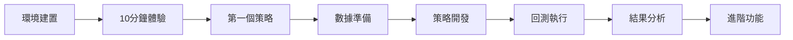

# 新手必讀

歡迎使用 TQuant Lab！這是一個強大的量化投資分析平台，幫助您進行策略開發與回測分析。

## 兩週學習計劃

### 第一週：基礎建置與快速體驗
- **第1-2天**：[環境建置](setup.md) - 安裝 TQuant Lab
- **第3天**：[10分鐘體驗](quick-demo.md) - 立即看到回測結果
- **第4-5天**：[第一個策略](first-strategy.md) - 建立你的投資策略

### 第二週：深入學習與實戰
- **第6-8天**：學習[資料下載](../example/documents3.md)與處理
- **第9-10天**：探索[策略回測](../example/documents55.md)功能
- **第11-14天**：實戰演練與[報表分析](../example/documents4.md)

## 學習路線圖

## 重要概念速覽

!!! tip "什麼是量化投資？"
    量化投資是運用數據分析和程式來制定投資決策的方法，讓投資更加客觀和系統化。

!!! info "TQuant Lab 能做什麼？"
    - 📊 **下載資料**：取得台股完整的歷史資料
    - 🧠 **開發策略**：用程式碼制定投資邏輯
    - 📈 **回測驗證**：模擬策略在過去的表現
    - 📋 **分析報告**：產生詳細的績效報表

## 開始使用

準備好了嗎？從[環境建置](setup.md)開始您的 TQuant Lab 之旅吧！

---

💡 **遇到問題？**
- 查看[常見問題](../example/documents37.md)
- 參考[完整技術手冊](../example/documents1.md)
